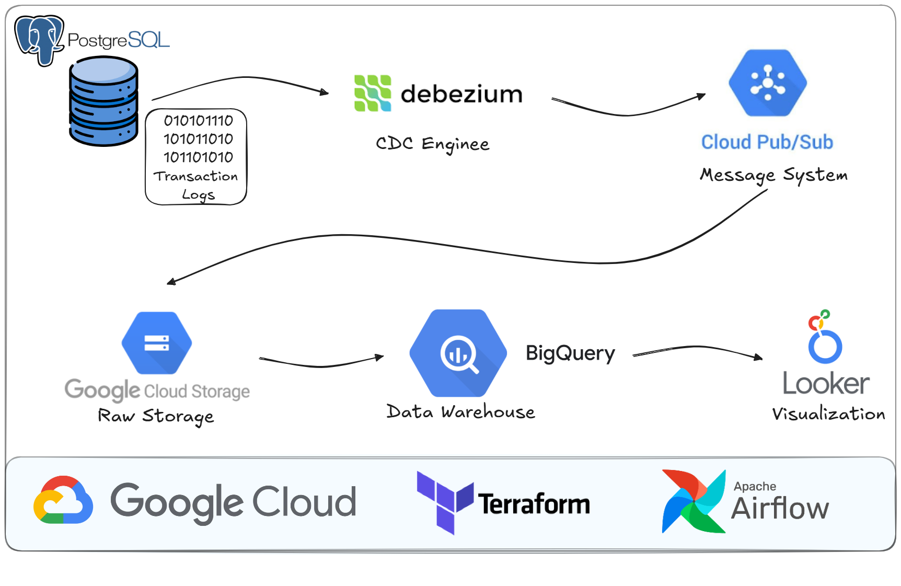

# E-Commerce Data Pipeline & Analytics Platform

A end-to-end data pipeline for e-commerce analytics built on Google Cloud Platform, featuring real-time change data capture (CDC), dimensional modeling with slowly changing dimensions (SCD Type 2), and incremental transformations using dbt.

## Table of Contents

- [Project Overview](#project-overview)
- [Architecture](#architecture)
- [Project Structure](#project-structure)
- [Data Model](#data-model)
- [Key Features](#key-features)
- [Looker Visualization](#looker-visualization)
- [Documentation](#documentation)

---

## Project Overview

This project implements a modern data warehouse solution for an e-commerce platform using Brazilian e-commerce datasets. It demonstrates best practices in:

- **Change Data Capture**: Real-time data ingestion from PostgreSQL using Debezium
- **Cloud Data Warehouse**: BigQuery for scalable analytics storage and processing
- **Data Transformation**: dbt for building dimensional models with SCD Type 2 tracking
- **Orchestration**: Apache Airflow for scheduling and monitoring data pipelines
- **Infrastructure as Code**: Terraform for reproducible GCP resource provisioning
- **Containerization**: Docker for consistent deployment across environments

### Key Objectives

1. Ingest transactional data from a production PostgreSQL database
2. Apply change data capture (CDC) for real-time data ingestion
3. Build dimensional models optimized for analytics queries
4. Track slowly changing dimensions (customers, sellers)
5. Provide a foundation for ML feature engineering and analytics

---

## Architecture

### Data Flow

1. **Ingestion**: PostgreSQL data captured via Debezium CDC and periodic snapshots exported to GCS
2. **Bronze Layer**: External tables in BigQuery pointing to CDC and snapshot data in GCS
3. **Silver Layer**: Incremental models with SCD Type 2 for slowly changing dimensions
   - Customers (tracking address/attribute changes)
   - Sellers (company info changes)
4. **Gold Layer**: Fact and dimension tables optimized for analytics queries
   - Big tables: Orders, Order_items

---

## Data Model

### Bronze Layer (Raw)
- **Source**: GCS files (CDC from Kafka, snapshots)
- **Tables**: External tables pointing to raw data
- **Update Frequency**: Real-time (CDC) + Daily (Snapshots)
- **Retention**: All historical data

### Silver Layer (Cleaned)
- **Transformations**: 
  - Data type standardization
  - Missing value handling
  - SCD Type 2 for slowly changing dimensions
- **Key Tables**:
  - `customers` (SCD Type 2 - address, profile changes)
  - `sellers` (SCD Type 2 - company info changes)
  - `orders`, `order_items`, `products`, `payments`, `geolocations`, `order_reviews`
- **Update Frequency**: Daily (incremental merge)

### Gold Layer (Analytics-Ready)
- **Purpose**: Optimized for analytics and BI tools
- **Key Tables**:
  - `order_bigtable` - comprehensive order analytics
  - `order_item_bigtable` - item-level analytics

## Key Features

### ✅ Change Data Capture (CDC)
- Real-time capture of PostgreSQL changes via Debezium
- Streaming to Kafka topics
- Efficient incremental loads

### ✅ Slowly Changing Dimensions (SCD Type 2)
- Track historical changes to customer attributes
- Track seller company information changes
- Maintain effective/end dates for record validity
- Enable point-in-time analysis

### ✅ Incremental Transformations
- dbt incremental models for efficient processing
- Merge operations for SCD Type 2 tables
- Only processes new/changed data

### ✅ Data Quality Tests
- dbt tests for uniqueness, nullability, relationships
- Custom dbt macros for complex validations
- Automated test execution in pipelines

### ✅ Infrastructure as Code
- Terraform for reproducible GCP setup
- Version-controlled infrastructure
- Easy environment replication

---

## Looker Visualization

This dashboard is built on top of the Gold layer (`order_bigtable`, `order_item_bigtable`) to provide business insights such as revenue trend, order volume, and top product performance.

---

## Documentation

- **[setup/postgres.md](setup/postgres.md)** - PostgreSQL setup guide
- **[setup/debezium.md](setup/debezium.md)** - Debezium setup guide
- **[setup/airflow_dbt.md](setup/airflow_dbt.md)** - Airflow & dbt setup guide

---

